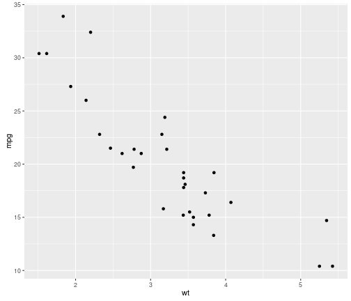

	   
## Slide 1
		
Use an empty line followed by three dashes to separate slides!

---


## A Simple Plot

Let us create a simple scatterplot.


```r
require(ggplot2)
qplot(wt, mpg, data = mtcars)
```


